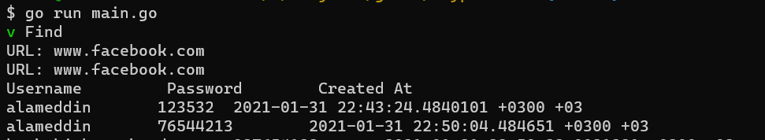

#### Offline Encrypted Password Storage
Çevrimdışı Şifrelenmiş Parola Defteri

`go build main.go` ile derledikten sonra `.\main` komutu ile direk çalıştırabilir ve şifrelerinizi kaydedebilirsiniz, Unutulmaması gereken nokta `private_key.pem` dosyasını ile `store.dat` dosyasını saklama sırasında ayrı disklerde tutunuz.

Önceki kayıtlı şifrelerinizde görüntülenecektir.

## Yapılacaklar
 - [ ] Şifre silme
 - [ ]  Hizalama
